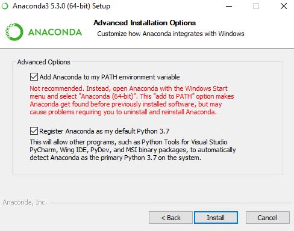

# Class-0
Installing Anaconda and Tensorflow on windows 10 

Please make sure you have Nvidia GPU (from Windows Device Manager) if you dont have, you can use your CPU but becarful when you install Tensorflow, just use the CPU version.

## Prerequisite
- [x] Windows 7/8/10.
- [x] At least 8GB RAM.
- [x] At least Processor core I3.

## Softwares you need to download

- [x] Anaconda [Download](https://www.anaconda.com/download/#windows).
- [x] Tensorflow (you dont need to download), just follow the instructions later.

### Step-1 
#### install Anaconda
If you install Anaconda for the first time, please check the first option, otherwise don't check it.

It would take a while depending on your PC.
