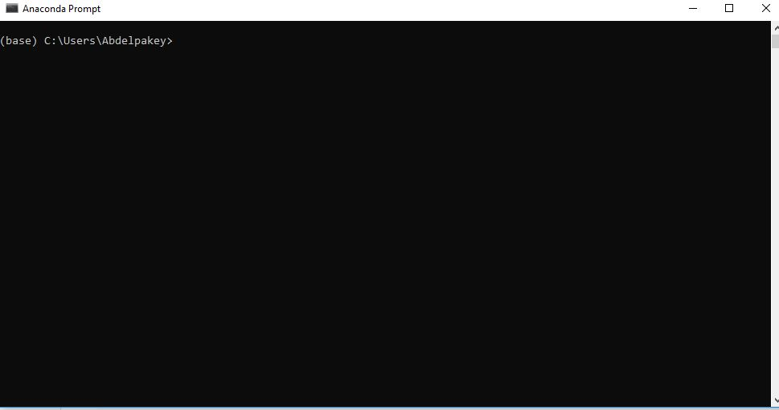
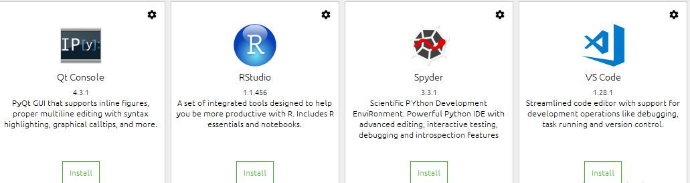

# Class-0
Installing Anaconda and Tensorflow on windows 10 

Please make sure you have Nvidia GPU (from Windows Device Manager) if you dont have, you can use your CPU but becarful when you install Tensorflow, just use the CPU version.

## Prerequisite
- [x] Windows 7/8/10.
- [x] At least 8GB RAM.
- [x] At least Processor core I3.

## Softwares you need to download

- [x] Anaconda [Download](https://www.anaconda.com/download/#windows).
- [x] Tensorflow (you dont need to download), just follow the instructions later.

# For CPU ONLY

### Step-1 
#### install Anaconda
If you install Anaconda for the first time, please check the first option, otherwise don't check it.

It would take a while depending on your PC.

If you got a blank (black/white) spyder window after installation then do:

source activate (yourenv) conda install -c anaconda pyopengl (https://anaconda.org/anaconda/pyopengl)

If you got spyder startup problem or error

source activate (yourenv)
conda list
you will see  sqlite
then remove it 
conda remove sqlite 
then open-up your anaconda and install spyder again   
#### Open-up Anaconda prompt

#### Creat a new enviroment with any name (e.g. tf)
conda create -n tf python=3.6 pip
### Step-2
In Anaonda prompt type in

#### Activate tf 
or
#### Conda activate tf

#### Pip install tensorflow (for CPU)
If you enconter issues try to use 
#### conda install -c conda-forge tensorflow 

### How to test your Anaconda and Tensorflow
Open-up anaconda and install Spyder

In Spyder, type in 

    import tensorflow as tf
    hello = tf.constant('Hello tensorflow')
    with tf.Session() as sesh:
        print(sesh.run(hello)) 
    
You should see "Hello tensorflow"

# For GPU (Nvidia)

## Step-1
Please do the previous step-1

## step-2
Install tensorflow:

First find if the GPU is compatible with Tensorflow GPU or not! from [Here](https://developer.nvidia.com/cuda-gpus)

